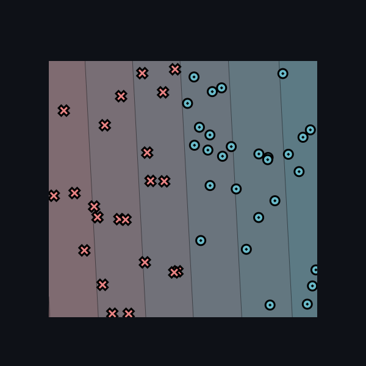
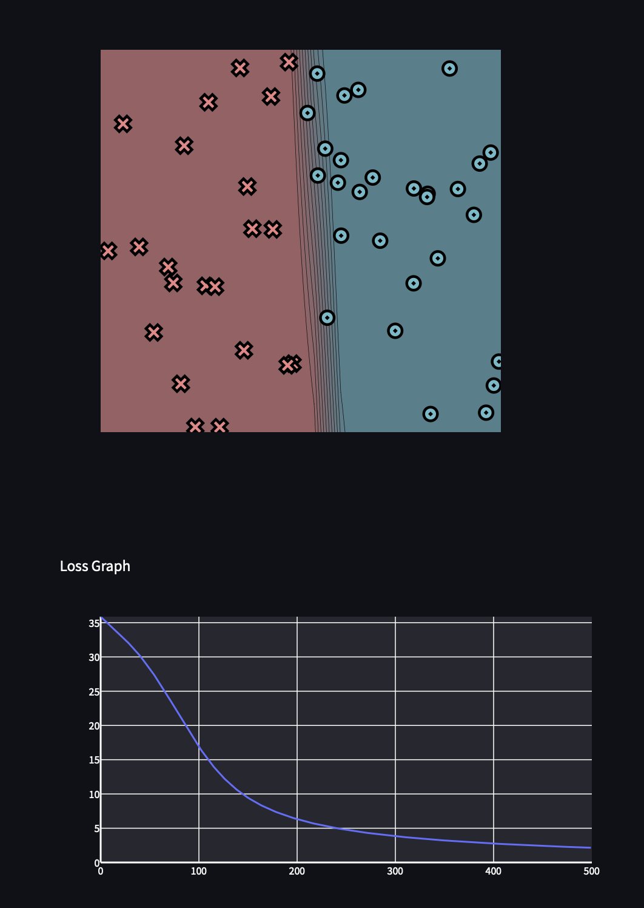
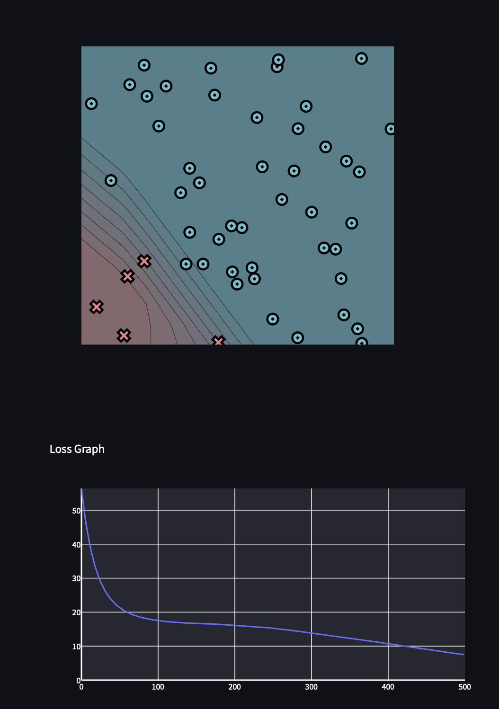
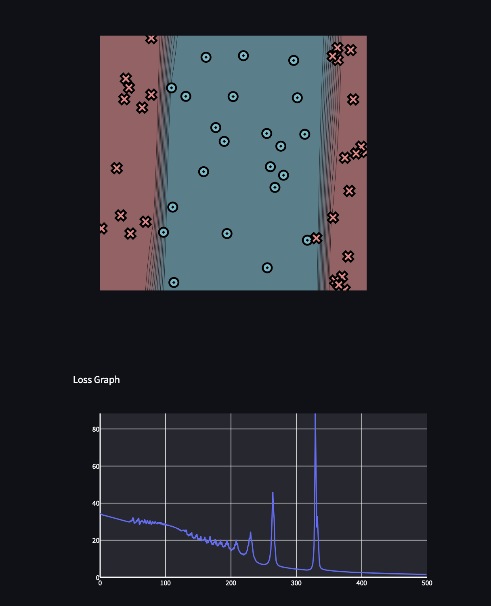
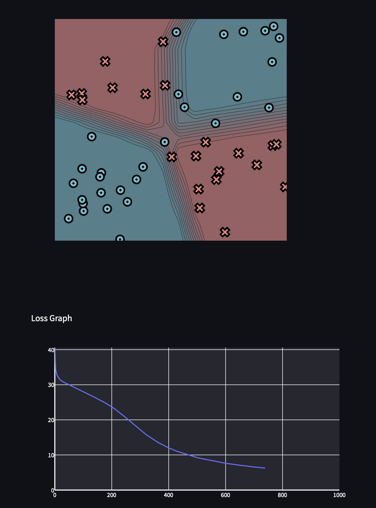
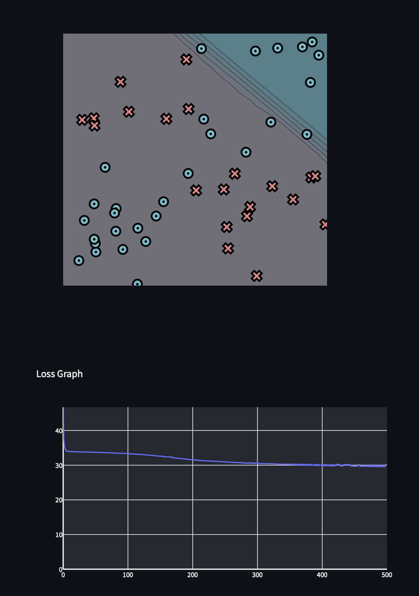
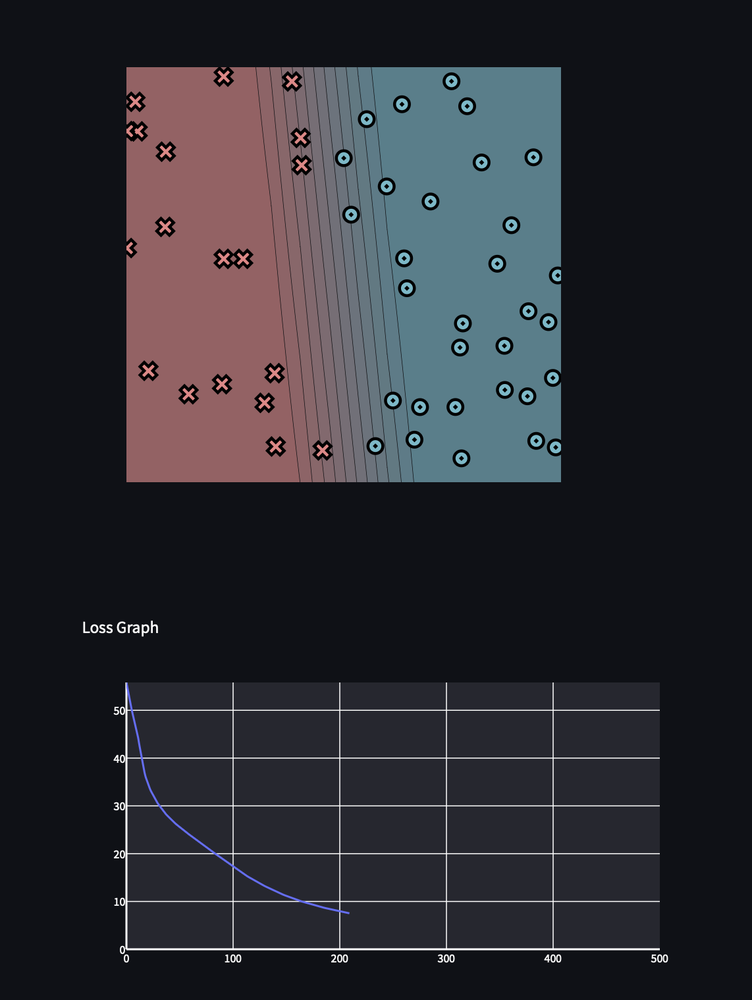
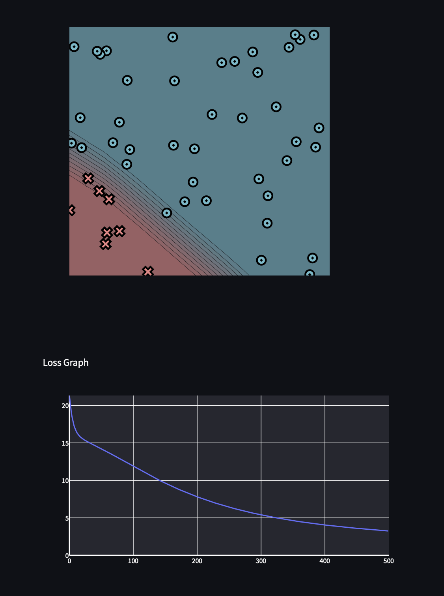
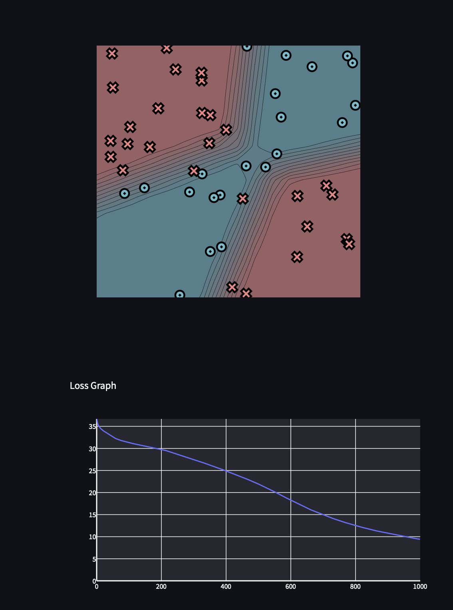
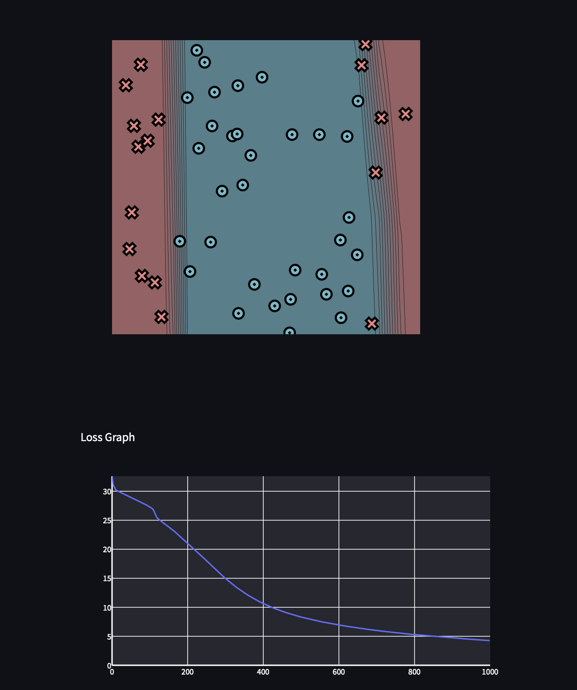

# Visualization results

Results for the MiniTorch visualization tasks.

## Task 0.5 — Module 0

Dataset visualization and hand-created linear classifiers.

### Simple

Parameters:

```text
weight_0_0 = -1.21
weight_1_0 = -0.06
bias_0 = 0.41
```

Result:



## Task 1.5 — Scalar training

Training results for the scalar model.

| Dataset | Hidden layers | Learning rate | Epochs | Final loss | Correct |
| --- | ---: | ---: | ---: | ---: | ---: |
| Simple |  |  |  |  |  |
| Diag |  |  |  |  |  |
| Split |  |  |  |  |  |
| Xor |  |  |  |  |  |

Screenshots:

### Simple

| Epochs | Final loss | Correct |
| ---: | ---: | ---: |
| 500 | 1.5319677969 | 50/50 |



### Diag

| Epochs | Final loss | Correct |
| ---: | ---: | ---: |
| 500 | 30.3233157022 | 29/50 |



### Split

| Epochs | Final loss | Correct |
| ---: | ---: | ---: |
| 500 | 14.3492259151 | 42/50 |



### Xor, hidden layer 10

| Epochs | Final loss | Correct |
| ---: | ---: | ---: |
| 500 | 17.4706381998 | 44/50 |



### Xor, hidden layer 3

| Epochs | Final loss | Correct |
| ---: | ---: | ---: |
| 500 | 20.3850323176 | 37/50 |



## Task 2.5 — Tensor training

Training results for the tensor model.

| Dataset | Hidden layers | Learning rate | Epochs | Time per epoch | Final loss | Correct |
| --- | ---: | ---: | ---: | ---: | ---: | ---: |
| Simple | 10 | 0.05 | 1000 | - | 4.6856 | 50/50 |
| Diag | 10 | 0.05 | 500 | — | 3.2544 | 49/49 |
| Split | 10 | 0.1| 1000 | - | 4.2522 | 48/50 |
| Xor | 10 | 0.05 | 1000 | — | 9.4129 | 47/49 |

Screenshots:





